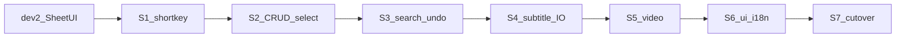
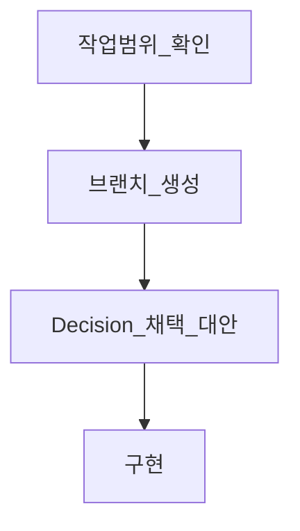
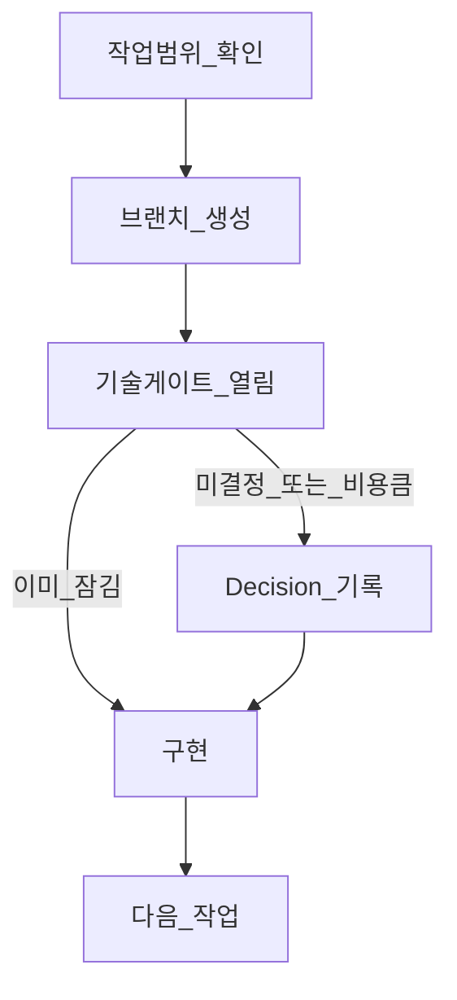

# 2.9 React 이전 — 전체 로드맵

바닐라 JS → React (`/edit`) 완전 변환까지의 **작업 가이드**다.  
구현 착수는 이 문서가 아니라, 사용자가 **한 슬라이스만** 지정했을 때 시작한다.

| 항목 | 내용 |
|------|------|
| 목표 | `/edit`가 **`public/js` 의존 없이** 편집기로 동작 → `VERSION` / tag **`2.9.0`** |
| 기준선 | **dev.2 완료** — Sheet UI · `subtitleSheets` 영속 · 셀 포커스 이동 ([changelog/2.9](../../changelog/2.9/)) |
| 브랜치 | `feature/tanstack-start` (신규 FE 기준) |
| 현재 릴리스 | `2.8.4` — `2.9.0`은 완전 변환 후에만 반영 |

## 현재 위치



| 상태 | 범위 |
|------|------|
| 완료 | TSS 골격, `/` 하이브리드, sheet 탭/셀 편집/포커스 이동/page 스냅/영속 |
| 임시 | 시트 이동·편집 **키보드가 widget `window` keydown에 직접 붙어 있음** (기존 `/`와 불일치) — **S1에서 shortkey로 이관** |
| 부분 | sheet — `selectedRows` 타입만, Tab 끝행 insert 미연결 ([dev.2 Notes](../../changelog/2.9/2.9.0-dev.2.md)) |
| 미착수 | shortkey 엔진, subtitle I/O, video, search, undo, i18n, settings 셸, analytics/ads |

### 키보드 진입 원칙 (parity)

- **시트** = 이동·편집·mutate 등 **동작 API**
- **shortkey** = 키보드 **진입점** (`defaultKeys` → `sheet.move` / `edit` 호출)
- S1에서 이 분리를 `/edit`에 맞춘다. 이후 슬라이스는 시트에 전역 `keydown`을 다시 붙이지 않는다.

## 작업 원칙

- **한 번에 하나** — 아래 슬라이스 중 **진행 중인 작업 하나**만 (버그/구조/UX/이전 혼재 금지). 슬라이스 전체가 한 브랜치라는 뜻은 아님
- **parity 우선** — 동작 동등성. 임의 UX 변경 없음
- **확인 → 브랜치 → Decision → 구현** — 아래 「브랜치·작업 단위」 순서 엄수
- **결정 먼저, 코드 나중** — 해당 **작업** 착수 전 관련 Decision을 **사용자와 대화에서** 닫은 뒤 구현. Decision에는 **채택 기술 + 대안(+기각 이유)** 을 반드시 포함한다
- **빈 FSD 폴더 사전 생성 금지** — 그 작업에 필요한 entity/feature/widget만 추가
- **changelog** — 사용자가 명시할 때만 `changelog/2.9/2.9.0-dev.N.md`에 Decision · 범위 · Verify 기록
- **이 폴더는 가이드만** — 로드맵 문서를 “구현하라”는 신호로 쓰지 않는다

## 브랜치·작업 단위

Git 히스토리와 동일하게, **브랜치 단위 = 작업(한 덩어리 변경)** 이다. Decision마다 브랜치를 기계적으로 하나씩 두지 않는다.

| 단위 | 역할 |
|------|------|
| **슬라이스** (S1…) | 로드맵 범위. 하나 이상의 작업을 담을 수 있다 |
| **작업** | 실제 진행 단위. **작업마다 브랜치 하나** (`type/scope`, 예: `feat/edit-shortkey-engine`) |
| **Decision** | 그 작업을 하기 전에 닫는 기술 선택 표. Decision ≠ 브랜치. 한 작업에 Decision 여러 행이 있을 수 있고, 슬라이스가 크면 작업(브랜치)이 여러 개 생길 수 있다 |

### 2.9 작업 시작 순서 (필수)

1. **이번 작업 범위 확인** — 어느 슬라이스·무엇을 할지 사용자와 확인 (슬라이스 전체가 아니라 **이번 브랜치에 넣을 작업**을 명확히)
2. **브랜치 먼저 생성** — 베이스 `feature/tanstack-start`에서 분기. 이름·범위 확인 없이 구현부터 시작하지 않는다. (`public/**` 수정 금지)
3. **Decision** — 채택 + 대안 + 이유 표. 미확정이면 구현 보류
4. **구현** → (사용자는 커밋/머지). changelog `dev.N`은 **사용자가 지시할 때만**




| 결정 | 채택 | 근거 |
|------|------|------|
| 앱 골격 | Vite + TanStack Start/Router + React + TS | dev.1 |
| 디렉터리 | FSD (`entities` / `widgets` / `shared` …) | 프로젝트 규칙 |
| 시트 윈도잉 | page 스냅 (Virtual **제거**) | dev.2 Decision |
| 시트 영속 | Zustand `persist` + `partialize`, 키 `subtitleSheets` | dev.2 |
| 뷰 상태 | `scroll` / `current` / `selectedRows`는 **디스크 제외** | dev.2 Notes |
| React Compiler | Oxc `compiler: true` | dev.2 Decision |
| `/` vs `/edit` | 하이브리드 유지, 완전 변환 전까지 `/` | README · 2.9 |
| 키보드 진입 | **shortkey** (시트 widget 전역 keydown 소유 금지 — S1 이후) | `defaultKeys` |

## 기술 결정 게이트



### 필수: 채택 기술 + 대안 제시

슬라이스를 **진행(착수·구현)할 때** AI/작업자는 Decision을 닫기 전에 아래를 **반드시** 제시한다. 채택만 적고 대안을 빼지 않는다.

| 항목 | 내용 |
|------|------|
| **채택** | 이번에 쓸 기술·구조·모델 (로드맵 기본값 또는 잠긴 결정) |
| **대안** | 검토한 다른 선택지 **1개 이상** (없으면 “대안 없음 + 이유”를 명시 — 생략 금지) |
| **이유** | 채택 이유 · 대안을 버리는 이유 (**parity** / 잠긴 결정 / 비용). **기존 기능을 “필요 없다”고 제외하는 이유로 쓰지 않는다** |
| **상태** | `잠김` · `기본채택` · `미확정(확인필요)` · `사용자확인` |

changelog를 작성할 때 `changelog/2.9/2.9.0-dev.N.md`의 `### Decision`에도 동일 형식으로 남긴다 (작성은 사용자 지시 시에만).

```markdown
### Decision

| 게이트 | 채택 | 대안 | 이유 / 기각 | 상태 |
|--------|------|------|-------------|------|
| 예: 키보드 진입 | shortkey 엔진 | 시트 widget window keydown 유지 | defaultKeys parity | 잠김 |
```

- 게이트가 열리면 **구현을 시작하지 않는다**. 위 표를 채운 뒤 진행한다.
- **잠긴 결정**도 표에 다시 적을 때 채택+대안(기각된 쪽)+이유를 적는다. 재논의는 하지 않되, **무엇을 버렸는지**는 보이게 한다.
- **미확정**은 채택 후보와 대안을 나란히 두고, 확인·사용자 확인 후 상태를 바꾼다.
- 구현 중 새 선택이 보이면: 슬라이스를 멈추고 Decision 표를 보강한 뒤 재개한다.

### 사용자 확인이 필요한 경우 (구현 전 한 번)

아래는 표를 채운 뒤에도 **사용자에게 채택/대안을 보여 주고** 한 번 확인한다.

- 새 **런타임 의존성** 추가
- 기존 `/`와 **의도적으로 다른 UX/데이터 스키마**
- localStorage **키·스키마 파괴적 변경** (migrate 경로 포함)
- **기존 `/`에 있는 기능을 이번 슬라이스/작업에서 빼거나 뒤로 미루는 경우** (후속 슬라이스·Remaining에 **넣을 곳**을 같이 제시)
- 로드맵에 `미확정` / `사용자확인`으로 표시된 게이트

## 검증 정책

[quality-verification](../../.cursor/rules/quality-verification.mdc)을 슬라이스 DoD에 항상 포함한다.

| 종류 | 정책 |
|------|------|
| 순수 로직 Vitest | **필수** — mutate/선택/파서/직렬화/타임코드/단축키 매칭 등 |
| 핵심 UI RTL | 권장 — 탭·검색·모달 등 이벤트 중심 |
| 수동 Verify | `dev.N` Verify 시나리오를 적어 두고, 완료 전 체크 |
| E2E | 2.9 기간에 Playwright 등 **신규 도입 안 함** |
| 소급 보강 | dev.1~2 대량 재테스트는 안 함. **해당 슬라이스분부터** 채움 |

## 슬라이스 순서

| ID | 제목 | 상세 | 상태 |
|----|------|------|------|
| S1 | Shortkey (엔진 + 시트 이동·에딧 키 이관) | [s1-shortkey.md](./s1-shortkey.md) | 미착수 |
| S2 | Sheet: 행 선택 + 행 CRUD | [s2-sheet-crud-select.md](./s2-sheet-crud-select.md) | 미착수 |
| S3 | Sheet: 검색 + undo/redo | [s3-search-undo.md](./s3-search-undo.md) | 미착수 |
| S4 | Subtitle I/O (SMI/SRT/VTT/JSON/Excel) | [s4-subtitle-io.md](./s4-subtitle-io.md) | 진행 중 (`feat/edit-subtitle-io`) |
| S5 | Video ↔ Sheet sync | [s5-video-sync.md](./s5-video-sync.md) | 미착수 |
| S6 | UI 셸 + i18n/settings | [s6-ui-i18n-settings.md](./s6-ui-i18n-settings.md) | 미착수 |
| S7 | Cutover (완전 변환 점검) | [s7-cutover.md](./s7-cutover.md) | 미착수 |

## Remaining — 기존 기능 (후속 일정)

`/`에 있는 기능은 **버리지 않는다**. 한 슬라이스에 다 못 넣으면 여기로 모으고, **넣을 곳·상태는 사용자가 확정**한다. (에이전트가 단독으로 “제외 확정” 금지)

| 항목 | | 넣을 곳 | 상태 |
|------|--------|---------|------|
| 풀 import/export 모달 · i18n 셸 | caption-shell 다이얼로그 | S6 (UI 셸만 · 포맷 로직은 S4) | 가이드 기본 |
| shortkey 커스텀 키 설정 UI | settings / customKeys UI | S6 또는 별도 작업 | **사용자 확정 필요** |

SMI/SRT/VTT/JSON/Excel · zip — **Remaining 아님. S4 (`feat/edit-subtitle-io`) I/O 범위.**

상세 슬라이스 문서의 Out of scope는 “이번 작업에 안 넣음 → Remaining(또는 넣을 슬라이스)”만 적는다.

## 구조·리팩터 (기능 아님)

구조 chore만. 기능 슬라이스와 섞지 않는다. 일정·범위는 사용자 확정.

- `use-sheet-cell-edit` 대규모 분해 (키 이관과 무관한 구조 분해)
- widget/entity 동명 파일 rename
- persist `beforeunload` flush
- analytics / ads
- 빈 `features/` · `pages/` 선제 생성
- video 재생 키 바인딩 (S5 shortkey 핸들러 — 기능은 S5)
